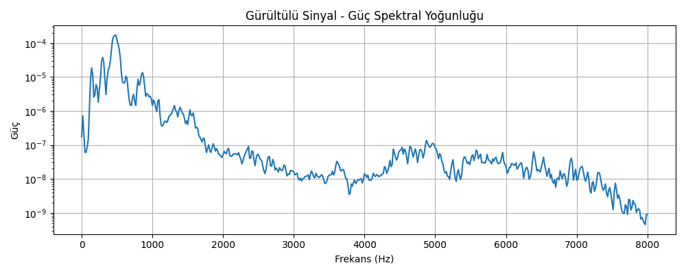
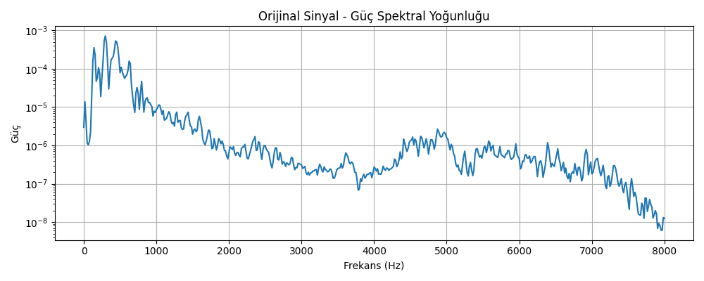
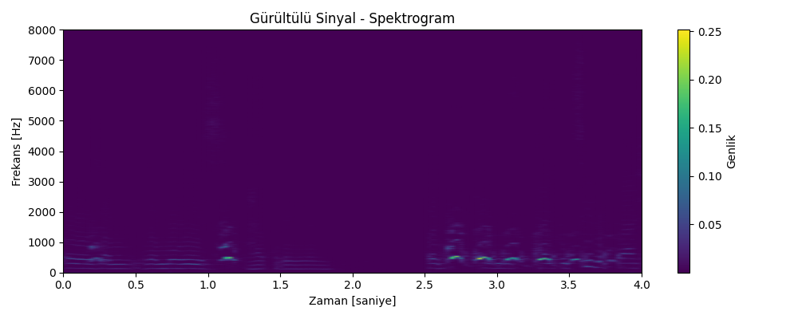
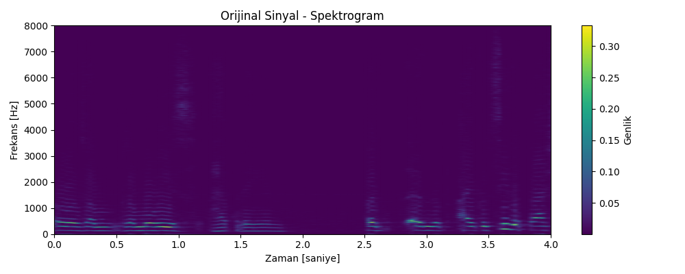

# speech-noise-cleaning
# 🎧 Speech Noise Cleaner – Using Frequency-Based Filters

This is a simple sound cleaning project that I built for my "Signals and Systems" course at university. The goal was to remove different types of background noise from audio recordings — without damaging the main speech.

---

## 🎯 What’s the Problem?

In real life, when you record a voice, you often hear other sounds too: fans, barking, traffic, or people in the background. These noises make it hard to understand what the person is saying.

So, the goal is:  
➡️ Find out what type of noise is in the recording  
➡️ Remove it as much as possible  
➡️ Keep the speech clear and natural

---

## ⚙️ How Does It Work?

We used several steps to clean the noisy audio:

### 1. 📊 Analyze the Sound (STFT)
We split the sound into very small parts and check which frequencies are strong at each moment. This is called **Short-Time Fourier Transform (STFT)**.  
It helps us “see” the noise.

### 2. 🔍 Detect the Type of Noise
We check the energy and frequency of the noise to decide what kind it is. For example:
- **Impulsive noise** → sudden sounds like a door slam
- **Low continuous noise** → like a fan or engine
- **High chirp sounds** → like birds
- **Clashing noise** → multiple sounds overlapping

### 3. 🧼 Apply the Right Filter (Mask)
Each noise type needs a different filter:
- **Hard Mask**: Blocks loud sudden noises completely  
- **Soft Mask**: Reduces soft noises gently  
- **Bird Mask**: Specially reduces high-frequency noises  
- **Speech Protection**: Keeps the human voice (300–3400 Hz) safe from distortion

### 4. 🔁 Turn Back to Normal Sound
After filtering, we convert the sound back into its original form using **inverse STFT** and save it as a `.wav` file.

---

## 📊 Example Results

We also created plots to show how the noise was reduced.

| Noisy Signal | After Cleaning |
|--------------|----------------|
|  |  |

| Noisy Spectrogram | Original Spectrogram | Cleaned Spectrogram |
|-------------------|----------------------|----------------------|
|  |  |  |

You can also listen to the before/after audio:

- 🎙️ Original: [audio/source/0_ORIGINAL.wav](./audio/source/0_ORIGINAL.wav)
- 🔊 Noisy: [audio/source/0_NOISY.wav](./audio/source/0_NOISY.wav)
- ✅ Cleaned: [audio/cleaned/0_SUPER_CLEANED.wav](./audio/cleaned/0_SUPER_CLEANED.wav)

---

## 🧠 Technologies Used

- **Python**  
- `NumPy`, `SciPy`, `Matplotlib`  
- Short-Time Fourier Transform (STFT)  
- Sound masks for different noise types  
- PSD & Spectrogram graphs

We learned how to work with sound signals and how to clean them using frequency information. We also learned how to write flexible Python code that can detect and reduce noise automatically.

